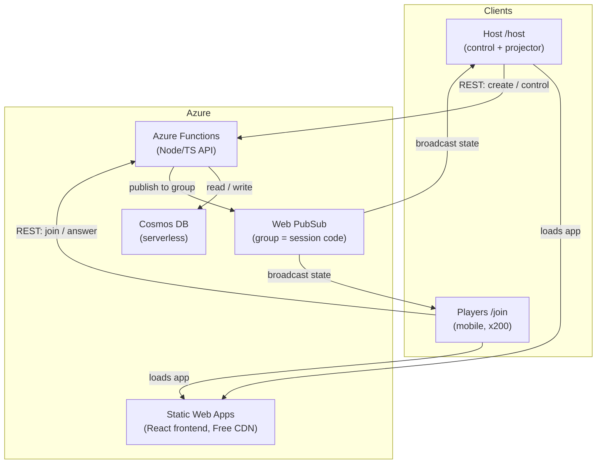
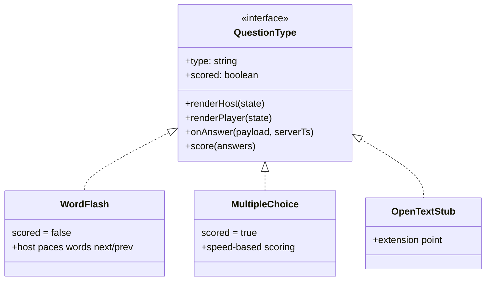
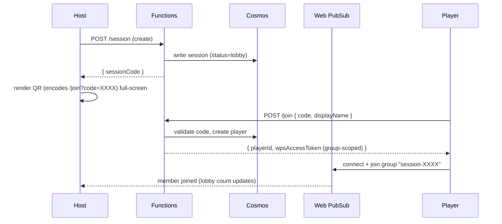
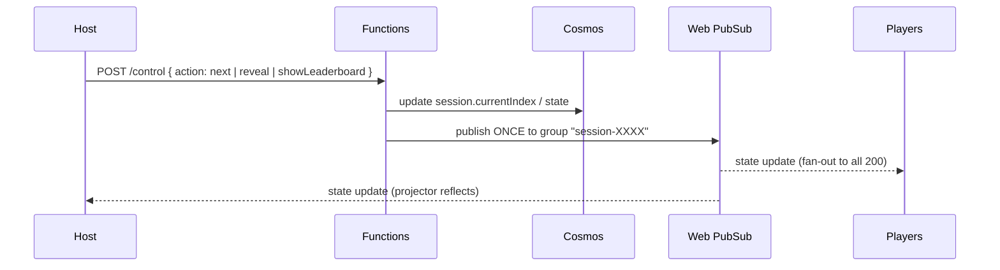
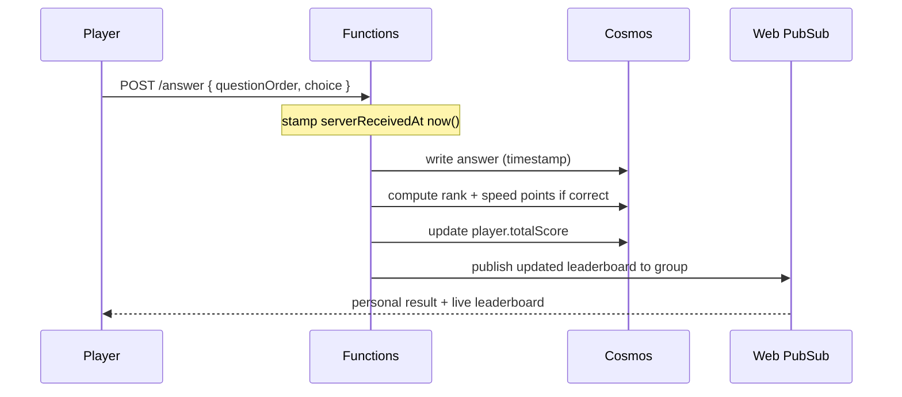

# Guild Live — Architecture Reference

Real-time, multiplayer audience-engagement game (Mentimeter / Kahoot style) for a single ~200-player, 1-hour event. **No authentication** — players join via a short code or QR.

> **Branding:** ING-inspired palette — ING orange `#FF6200` (primary), supported by gray, white, violet, blue. Persistent badge: **"Cloud Engineering Guild"**.

---

## 1. Stack (fixed)

| Layer | Service | Tier / Notes |
|---|---|---|
| Frontend | React + TypeScript (Vite) | Azure Static Web Apps — **Free** |
| Backend | Azure Functions (Node + TypeScript) | Consumption plan |
| Real-time | Azure Web PubSub | **Standard, 1 unit** — group-per-session |
| Database | Azure Cosmos DB (NoSQL API) | **Serverless** (never provisioned) |
| IaC | Terraform | Local tfstate, single resource group |

**Cost:** Web PubSub is the only metered cost (~$1.61/day). Everything else stays on free tiers. **Run `terraform destroy` after the event.**

---

## 2. System overview

**Key rule for 200 players:** the host publishes **once** to the session group; Web PubSub fans out to all members. Never loop a send per connection.

---

## 3. Data model (Cosmos, serverless)

Partition by `sessionCode` everywhere so all reads/writes for a live game hit one logical partition.

| Container | Partition key | Fields |
|---|---|---|
| `sessions` | `/sessionCode` | `sessionCode`, `status` (`lobby` / `active` / `ended`), `currentIndex`, `currentState`, `createdAt` |
| `questions` | `/sessionCode` | `sessionCode`, `order`, `type` (`wordflash` / `multiplechoice` / …), `payload`, `correctAnswer?`, `points?` |
| `players` | `/sessionCode` | `sessionCode`, `playerId`, `displayName`, `connectionId`, `joinedAt`, `totalScore` |
| `answers` | `/sessionCode` | `sessionCode`, `questionOrder`, `playerId`, `choice`, `serverReceivedAt`, `pointsAwarded`, `answerRank` |

`serverReceivedAt` is set **server-side** (never trust client time) and is the basis for both speed scoring and "who answered first."

---

## 4. Question-type abstraction

Build Word Flash first, but keep the core loop type-agnostic.

- **Word Flash** — host flashes words/phrases one at a time, controls pacing, no scoring.
- **Multiple Choice** — has a correct answer; **speed-based (Kahoot-style)** scoring.
- **OpenText / word-cloud** — stub + extension point only for v1.

---

## 5. Core sequences

### 5.1 Create session + player join (code / QR)

### 5.2 Host advances state → broadcast

### 5.3 Answer + speed scoring (Multiple Choice)

**Speed scoring (reference formula):** for a correct answer, award
`points = round(maxPoints * (1 - timeTaken / timeLimit))`, floored at some minimum (e.g. `0.5 * maxPoints` for any correct answer) so late-but-correct still scores. `answerRank` (1st, 2nd, …) is derived from `serverReceivedAt` ordering and stored for the "answered first" record.

---

## 6. Reconnection handling

Connections are disposable; **Cosmos is the source of truth.** On any reconnect:

1. Client re-calls `/join` (or a lightweight `/session/state`) with its stored `playerId` + code.
2. Backend returns a fresh group-scoped Web PubSub token + the **current session state** (index, current question, leaderboard).
3. Client rehydrates UI from that state — no replay of missed messages needed.

This covers player refresh, host refresh mid-game, and flaky mobile networks in a packed room.

---

## 7. Routes

| Route | Audience | Purpose |
|---|---|---|
| `/host` | Presenter | Create session, full-screen QR, projector display, controls (flash next, advance, reveal, show leaderboard) |
| `/join` | Players (mobile) | Enter code or land via QR, pick display name, answer, see personal score |

---

## 8. Milestones (build order)

1. **Infrastructure** — Terraform: RG, SWA (Free), Function App + storage, Web PubSub (Standard 1 unit), Cosmos (serverless). Outputs wired; `terraform destroy` works.
2. **Backend** — Functions: create, join (+ WPS token), negotiate, answer (server timestamp + speed score), control (group publish), leaderboard.
3. **Frontend** — `/host` + `/join`; **Word Flash end-to-end first**, then Multiple Choice with speed scoring, then final ranking. ING theme + Guild badge.
4. **Deploy & docs** — wire frontend → deployed backend, deploy SWA + Functions from Terraform outputs, README with cost note + **destroy reminder**.

---

## 9. Operational guardrails

- Cosmos **must** be serverless — provisioned throughput adds a ~$24/mo floor.
- Static Web Apps **must** be Free — Standard adds a $9/mo flat fee.
- Web PubSub bills **per unit per day** (no hourly proration) — 1 hour still = 1 day ≈ $1.61.
- Create everything in **one resource group**; `terraform destroy` (or delete the RG) immediately after the event guarantees no lingering charges.
